# CreditIQ – AI-Powered Credit Risk Underwriting Platform

CreditIQ is an end-to-end credit risk intelligence workspace built on the **Home Credit Default Risk** dataset. It helps analysts and underwriters move from raw application data to scored decisions, explanations, and portfolio insight in one place.

Traditional underwriting is often **slow**, **inconsistent**, and **hard to explain** to business and compliance stakeholders. CreditIQ combines:

- **Machine learning** — default probability and risk bands (LightGBM, 109 features)
- **Explainable AI** — SHAP-based drivers at portfolio and applicant level
- **Business rules** — transparent approve / review / decline policies
- **Portfolio analytics** — executive KPIs and segment views
- **LLM-powered data analysis** — ask portfolio questions in plain English via Groq

| | |
|---|---|
| **Dataset** | Home Credit Default Risk |
| **Records** | 307,511 applications |
| **Target** | Loan default prediction (`TARGET`) |
| **Model** | LightGBM · 109 features · `scale_pos_weight` |
| **Holdout metrics** | ROC-AUC 0.762 · PR-AUC 0.252 · Recall 0.434 |
| **Explainability** | SHAP (global + local) |
| **LLM** | Groq NL→SQL + summarization |
| **Frontend** | Streamlit |
| **Backend** | Python + FastAPI |

**Author:** [Nailasalim](https://github.com/Nailasalim)

---

## Features

### Executive Dashboard

- Portfolio KPIs (applications, default rate, approval rate, high-risk exposure)
- Portfolio analytics: risk distribution, approval decision mix, predicted default probability bands, risk segment volume
- Top risk and positive SHAP drivers
- Recent session assessments from Risk Prediction

### Data Explorer

- Dataset overview and KPIs
- Demographics (age, gender, employment tenure)
- Financial analysis (income, credit, annuity, scatter views)
- Risk segmentation and data quality assessment
- Interactive Plotly charts with sidebar filters

### Risk Prediction

- Applicant scoring via FastAPI (`/decision`)
- Probability of default and risk score (0–100)
- Risk band assignment (Low / Medium / High)
- Approve / Review / Decline recommendation
- Session assessment history on the dashboard

### Explainability

- SHAP-based local explanations per applicant
- Global feature importance (mean |SHAP|)
- Top risk and protective drivers with contribution chart (red = increases risk, green = decreases risk)
- Concise narrative summary per assessment

### Decision Rules

- Underwriting rules engine (7 structured policies: R001–R007)
- Live rule matching on applicant payloads
- Human-readable conditions and rule reasons
- Confidence, coverage, precision, and lift metrics

### AI Data Analyst

- Natural language → SQL via **Groq** (`llama-3.3-70b-versatile`)
- Result summarization via Groq (one-line business insight)
- **SELECT-only** SQL validation (rejects DROP, DELETE, INSERT, UPDATE)
- Schema-grounded prompts over `application_train` + portfolio KPIs
- In-memory SQLite — no external database server

### Login & navigation

- Session-based login (demo accounts)
- Dark enterprise UI with sidebar navigation across all modules

---

## Architecture

<p align="center">
  
</p>

| Layer | Role |
|-------|------|
| **Streamlit** | App shell — dashboard, EDA, risk, XAI, rules, AI analyst, login |
| **FastAPI** | Inference API — `/predict`, `/decision`, `/rules`, `/health`, `/dashboard/summary` |
| **LightGBM** | Default probability and risk bands (109 features) |
| **SHAP** | Global importance + per-applicant contributions |
| **Rules engine** | Business policies alongside model scores |
| **Groq API** | NL→SQL and result summarization for AI Data Analyst |
| **SQLite (in-memory)** | Portfolio Q&A over `application_train` |

**Communication patterns**

- **HTTP:** Risk Prediction and Decision Rules call FastAPI
- **Local imports:** Dashboard, Explainability, Data Explorer run in-process
- **Batch scoring:** Full portfolio scored once; KPIs cached in `models/portfolio_scoring_snapshot.json`

---

## Machine learning pipeline

| Stage | Description |
|-------|-------------|
| Dataset | Home Credit `application_train` (307,511 labeled rows) |
| Feature engineering | **109 features** — label-encoded categoricals, 3 financial ratios, redundant document flags removed |
| Imputation | Median imputation (`SimpleImputer`, training-fit) |
| Training | LightGBM with **`scale_pos_weight`** (~11.4 for 8.1% default rate) |
| Evaluation | ROC-AUC, **PR-AUC**, precision, recall, F1 on stratified holdout |
| Threshold | F1-tuned on holdout (currently **0.65**) |
| Risk bands | Low / Medium / High from probability cutoffs |
| Decision | Model score + rules → Approve / Review / Decline |

### Holdout metrics

| Metric | Value |
|--------|-------|
| ROC-AUC | 0.762 |
| PR-AUC | 0.252 |
| Accuracy | 0.848 |
| Precision | 0.248 |
| Recall | 0.434 |
| F1 score | 0.316 |
| Decision threshold | 0.65 |
| Features | 109 |
| `scale_pos_weight` | 11.39 |

**Retrain & refresh dashboard KPIs:**

```powershell
python scripts/train_model.py
python scripts/build_portfolio_snapshot.py
```

### Model selection rationale

**LightGBM** was chosen for strong tabular performance on structured financial and bureau features, efficient training on 307k+ rows, native handling of class imbalance via `scale_pos_weight`, and compatibility with SHAP explainability — without synthetic oversampling (SMOTE).

### Class imbalance strategy

| Class | Share |
|-------|-------|
| Non-default | 91.9% |
| Default | 8.1% |

- **`scale_pos_weight`** up-weights the minority default class during training
- **No SMOTE** — natural distribution preserved for honest evaluation
- **PR-AUC and recall** prioritised over accuracy alone
- Threshold tuned on holdout for underwriting trade-offs

### Rule derivation logic

Rules complement the LightGBM score — they do not replace it.

| Risk band | Typical action |
|-----------|----------------|
| Low | Approve |
| Medium | Review |
| High | Decline |

Rules highlight which policies fire for an applicant, improving transparency for analysts and compliance reviewers.

### Example decision outputs

**Low risk** — Risk score 22 · Band Low · **Approve**  
**Medium risk** — Risk score 54 · Band Medium · **Review**  
**High risk** — Risk score 81 · Band High · **Decline**

---

## AI Data Analyst (Groq LLM integration)

| Step | Model | Role |
|------|-------|------|
| NL → SQL | `llama-3.3-70b-versatile` | Plain English → validated SQLite `SELECT` |
| Summarization | `llama-3.3-70b-versatile` | One-line business summary of results |

**How it works**

1. User asks a question (or selects a suggested chip)
2. Schema-grounded prompt sent to Groq (column hints for `application_train` + `portfolio_kpis`)
3. SQL validated — **SELECT only**; destructive statements rejected
4. Query runs on in-memory SQLite
5. Groq summarizes results in one business sentence

**Supported query patterns:** aggregation, grouping, filtering, ordering, conditional comparisons (AND/OR/BETWEEN)

**Token optimization:** compact schema prompts, SELECT-only guardrails, 15-row JSON preview for summarization, auto `LIMIT 500`

Copy [`.env.example`](.env.example) → `.env` and set `GROQ_API_KEY` from [console.groq.com](https://console.groq.com).

---

## Portfolio metrics (batch-scored book)

| Metric | Value |
|--------|-------|
| Applications | 307,511 |
| Observed default rate | 8.1% |
| Approval rate (policy) | ~56% |
| High-risk exposure (HIGH band) | ~14% |

---

## Screenshots

All captures live in [`documents/screenshots/`](documents/screenshots/).

### Executive Dashboard

| | |
|:---:|:---:|
| Overview & KPIs | Portfolio analytics |
| 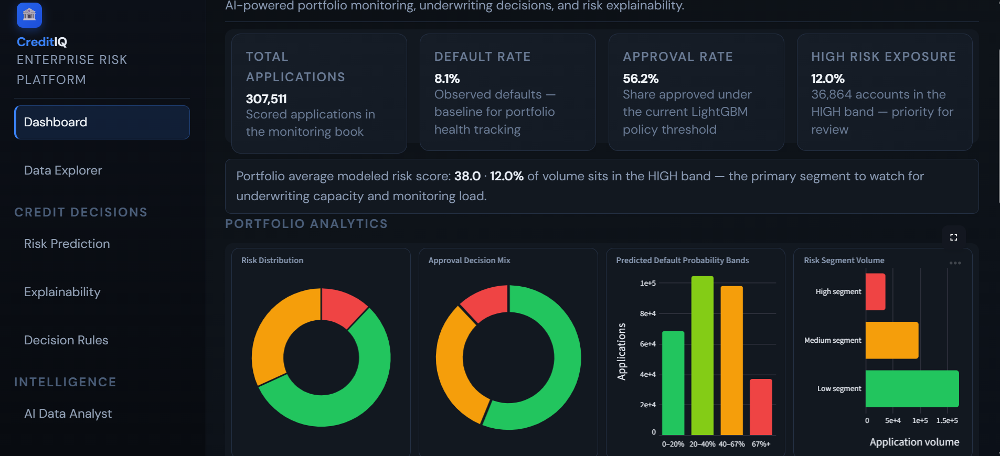 | 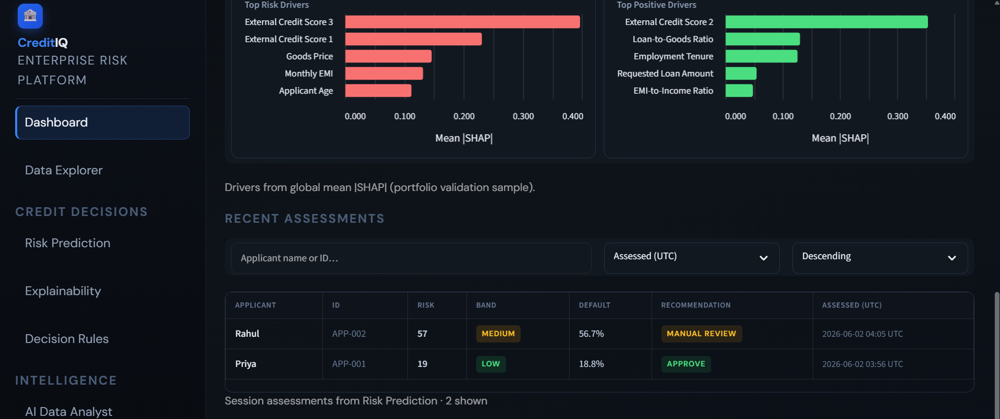 |

### Data Explorer

| | |
|:---:|:---:|
| Overview | Demographics / financial |
| 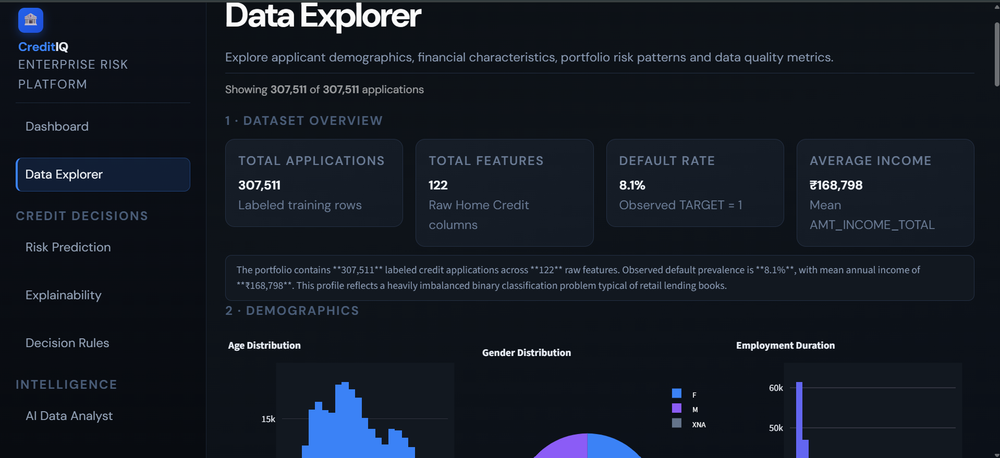 |  |

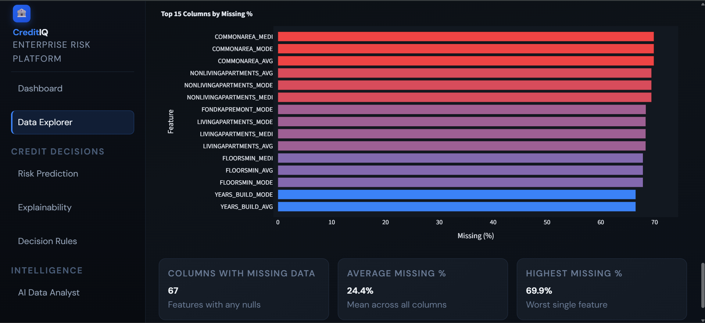

### Risk Prediction

| | |
|:---:|:---:|
| Applicant form | Scoring result |
|  | 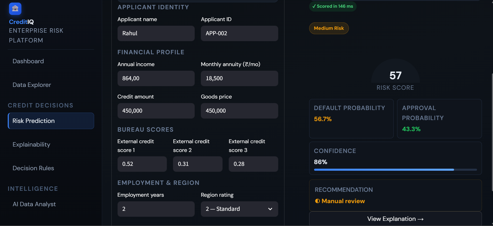 |

### Explainability

| | |
|:---:|:---:|
| Risk summary & drivers | SHAP contribution chart |
|  | 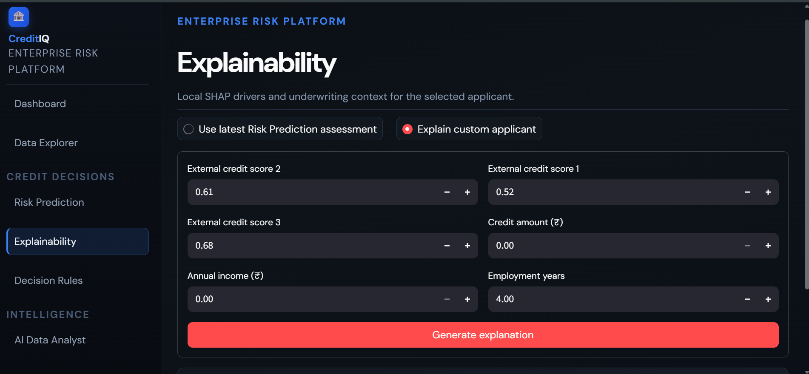 |

### Decision Rules

| | |
|:---:|:---:|
| Rules library | Rule evaluation |
| 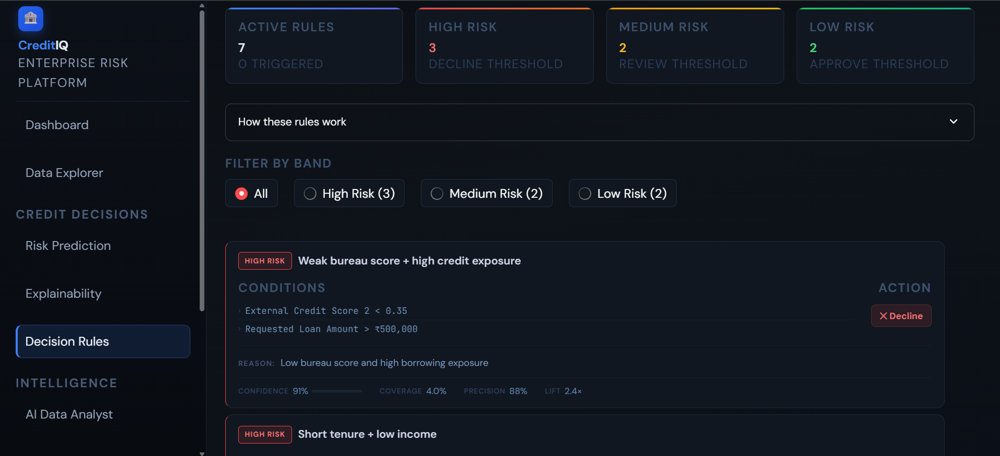 | 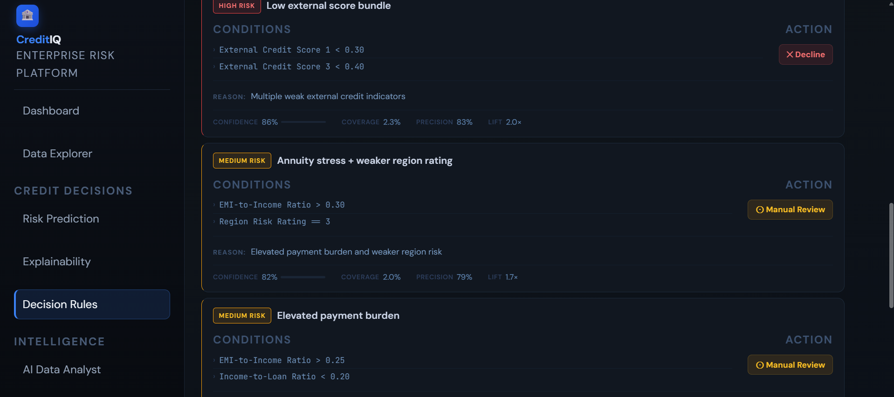 |


### AI Data Analyst

| | |
|:---:|:---:|
| Query & conversation | SQL, results & insight |
| 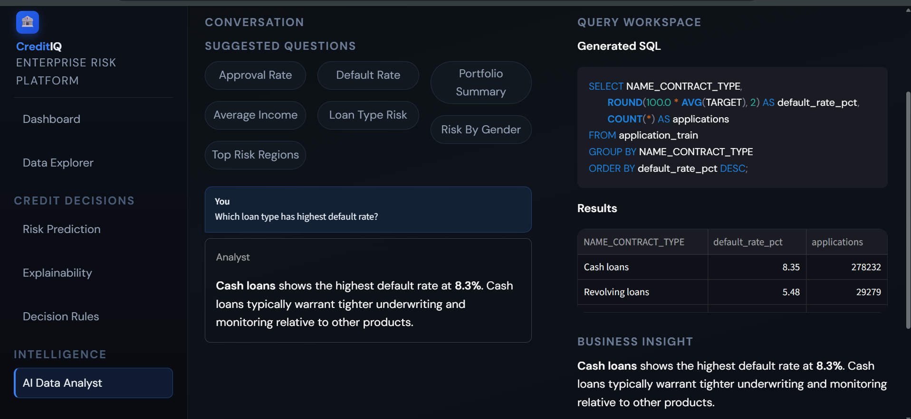 |  |

### Model evaluation (training phase)

| | |
|:---:|:---:|
| ROC curve | SHAP summary |
| 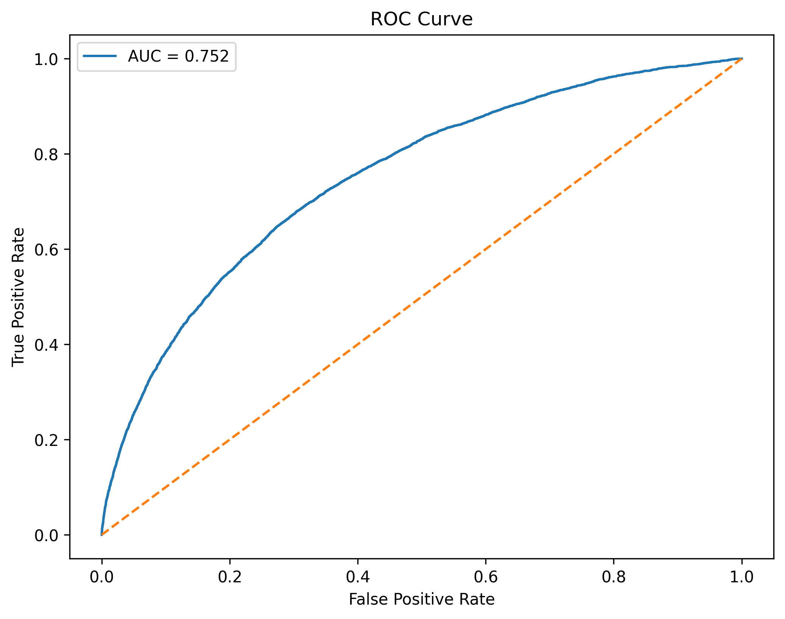 | 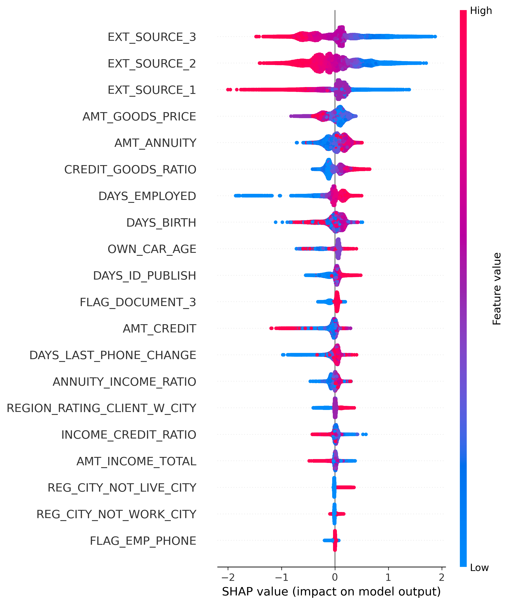 |

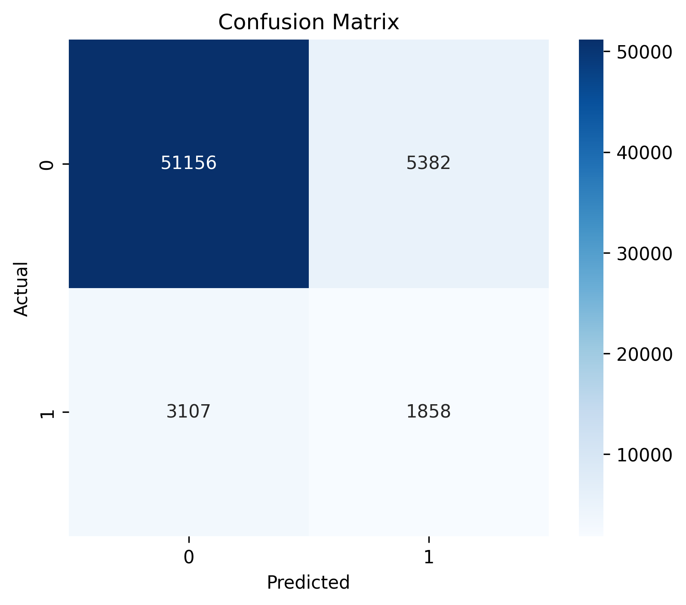

---

## Installation

**Requirements:** Python 3.11+, Git

```powershell
git clone https://github.com/Nailasalim/<your-repo>.git
cd credit_risk_prediction
python -m venv .venv
.\.venv\Scripts\Activate.ps1
pip install -r requirements.txt
```

Use **`scikit-learn==1.7.0`** as pinned in `requirements.txt` (matches `models/imputer.pkl`).

**Dataset:** place `application_train.csv` in `data/` (not committed to Git).

**Groq (AI Data Analyst):**

```powershell
copy .env.example .env
# Set GROQ_API_KEY=your_key_from_console.groq.com
```

---

## Run locally

**Terminal 1 — API**

```powershell
$env:PYTHONPATH="."
uvicorn src.api.main:app --reload --port 8000
```

API docs: [http://127.0.0.1:8000/docs](http://127.0.0.1:8000/docs)

**Terminal 2 — Streamlit UI**

```powershell
$env:PYTHONPATH="."
streamlit run ui/streamlit_app.py
```

Open [http://localhost:8501](http://localhost:8501)

| Variable | Default | Purpose |
|----------|---------|---------|
| `GROQ_API_KEY` | — | Required for AI Data Analyst |
| `GROQ_NL2SQL_MODEL` | `llama-3.3-70b-versatile` | NL → SQL |
| `GROQ_SUMMARY_MODEL` | `llama-3.3-70b-versatile` | Result summarization |
| `CREDIT_RISK_API_URL` | `http://127.0.0.1:8000` | UI → FastAPI |
| `CREDIT_RISK_PORTFOLIO_CSV` | `data/application_train.csv` | Dashboard, EDA, AI analyst |

---

## Run with Docker

Validated locally with `Dockerfile` + `docker-compose.yml`.

**Prerequisites:** Docker Desktop, `data/application_train.csv`, `models/` artifacts, `.env` with `GROQ_API_KEY`

```powershell
docker compose up --build
```

| Service | URL |
|---------|-----|
| Frontend (Streamlit) | [http://localhost:8501](http://localhost:8501) |
| Backend (FastAPI) | [http://localhost:8000](http://localhost:8000) |

---

## Demo credentials

| Username | Password |
|----------|----------|
| `analyst` | `CreditIQ2024` |

Additional: `admin` / `admin123`, `risk_officer` / `risk2024`

### Suggested demo path (~3 min)

1. **Dashboard** — portfolio KPIs and analytics
2. **Risk Prediction** — score one applicant (API must be running)
3. **Explainability** — review SHAP drivers
4. **Decision Rules** — show matched policies
5. **AI Data Analyst** — ask a portfolio question or use a suggested chip

---

## Project structure

```
credit_risk_prediction/
├── src/api/              # FastAPI
├── src/data/             # Feature engineering (109), loaders, encoders
├── src/llm/              # Groq NL→SQL + summarization
├── src/ml/               # Predict, rules, portfolio analytics, SHAP
├── ui/                   # Streamlit pages
├── models/               # model.pkl, encoders, imputer, metrics, SHAP, snapshot
├── data/                 # application_train.csv (local only)
├── scripts/              # train_model.py, portfolio snapshot, imputer
├── documents/screenshots/
├── Dockerfile
├── docker-compose.yml
└── requirements.txt
```

---

## Known limitations

- Only **`application_train.csv`** — bureau, installment, and balance tables not joined
- **`EXT_SOURCE_1/2/3`** are anonymised in Home Credit
- Login uses **demo session credentials**, not production SSO
- Risk Prediction form sends core fields; remaining features median-imputed at inference

---

## Project status

| Module | Status |
|--------|--------|
| Executive Dashboard | ✓ Complete |
| Data Explorer | ✓ Complete |
| Risk Prediction | ✓ Complete |
| Explainability | ✓ Complete |
| Decision Rules | ✓ Complete |
| AI Data Analyst (Groq) | ✓ Complete |
| Login & app shell | ✓ Complete |
| Docker deployment | ✓ Complete (validated locally) |

---

## License

This project is released under the [MIT License](LICENSE). You are free to use, modify, and distribute it with attribution.
